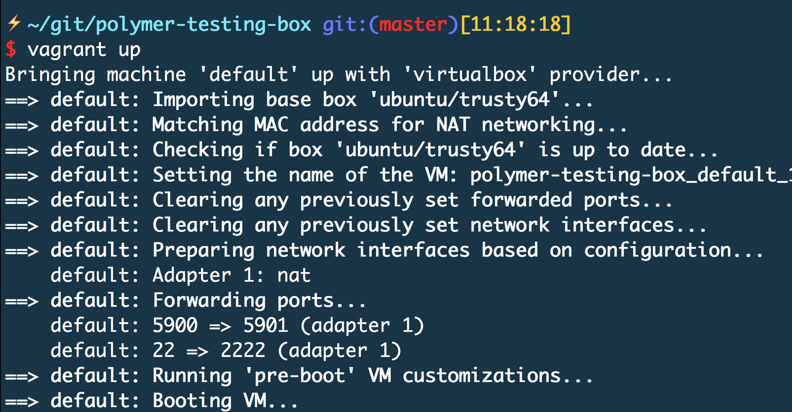
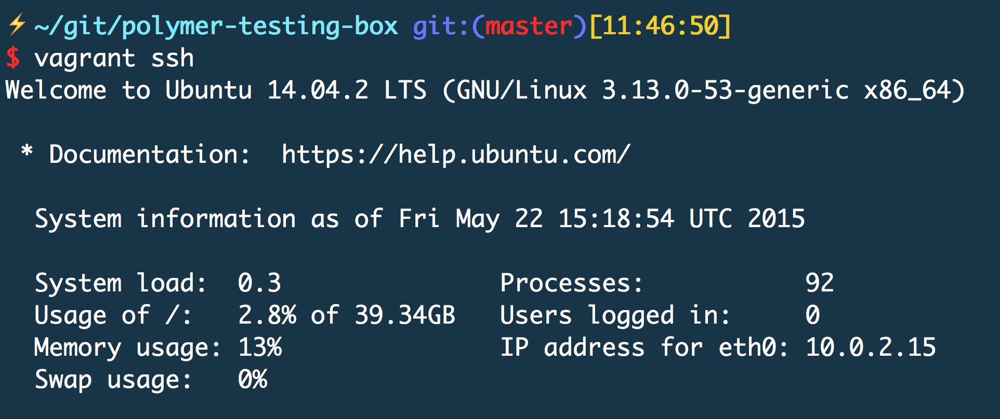

title: Headless Testing Against Real Web Browsers
author:
  name: Mike Ball
  url: https://github.com/mdb
output: index.html
style: style.css

---

# Headless Testing

## Against Real Web Browsers with Xvfb

---

### Before we get started...a challenge

* slides are at [github.com/mdb/testing-with-xvfb](http://github.com/mdb/testing-with-xvfb)
* [TravisCI](https://travis-ci.org/mdb/testing-with-xvfb) compiles the slides, executes crude tests using Xvfb, and auto-deploys `master` to [mdb.github.io/testing-with-xvfb](http://mdb.github.io/testing-with-xvfb)

Submit a PR fixing the [fix-my-code](https://github.com/mdb/testing-with-xvfb/tree/fix-my-code) branch based on its failing tests!

---

<!-- headshot -->

---

# Mike Ball

## [mikeball.info](http://mikeball.info)
## [github.com/mdb](http://github.com/mdb)
## [twitter.com/clapexcitement](http://twitter.com/clapexcitement)

---

<!-- comcast logo -->

---

<!-- xtv screenshot -->

---

<!-- xfinity-origin -->

---

# Prologue

## Why are we talking about this?

---

<!-- jsconf 2015 -->

---

# But...

## Where are we now?

---

# My Beliefs

---

### Automated Tests

* ensure software works as it should
* help team move fast
* help us understand how change impacts the larger system
* help ensure customer quality

---

### Continuous Integration

* ensures a codebase's health is continuously monitored with each change
* methodically consistent, easily repeatable
* as fast and cheap as possible, while still honoring its responsibilities
* feedback cycle!

---

### My career

Growth means increased responsibility...

* more and more of the full stack
* build, deploy, release operations
* production support operations
* quality

---

# I <3 automation

## It's a cold, messy, imperfect world out there
## Let's build something that works

---

# Cheap servers!

## Virtualization, containers, cloud infrastructure, etc.

---

### Headless testing helps

* phantomjs
* EnvJS
* Rhino
* RubyRacer
* Node.js
* etc.

---

# The Problem

---

## What if your technology can't run in one of these headless runtimes?

---

# Huh?

---

### For example

* Flash
* NW.js
* Electron
* Google Polymer web-component-tester

---

## Let's focus on Google Polymer

---

### Google Polymer

Google technology for authoring applications with web components

---

<!-- xtv movies -->

---

### web-component-tester

[github.com/Polymer/web-component-tester](http://github.com/Polymer/web-component-tester)

---

### But...

`web-component-tester` assumes a GUI.

And a real web browser(s).

And virtualized CI build agents don't have a display.

---

### Candidate Solutions

* TravisCI
* Sauce Labs

---

### TravisCI

[docs.travis-ci.com/user/gui-and-headless-browsers](https://docs.travis-ci.com/user/gui-and-headless-browsers)

* Xvfb
* Firefox

---

# Sidebar...

---

### 2015

* little-known TravisCI feature
* many Polymer projects overlooked CI altogether

...hence my JSConf 2015 talk.

---

### Today

Much more common!

* [travis-ci.org/Polymer/polymer](https://travis-ci.org/Polymer/polymer)
* [travis-ci.org/PolymerElements/iron-ajax](https://travis-ci.org/PolymerElements/iron-ajax)

---

```
language: node_js

before_script:
  - npm install -g bower web-component-tester
  - bower install

addons:
 firefox: '46.0'
 apt:
  sources:
    - google-chrome
  packages:
    - google-chrome-stable

script:
  - xvfb-run wct
```

---

# So...

---

<!-- thumbs up-->

---

### Sauce Labs CI

[saucelabs.com](http://saucelabs.com)

* Selenium cloud
* Access to over 100 device/OS/browser combos

---

# But...

## What if your team can't use these?

---

### Whatchu mean?

* SLA
* budget
* networking/firewall/security restrictions

---

### Enter X Virtual Frame Buffer

AKA Xvfb

run GUI applications (like web browsers) with no display!

(how TravisCI runs web browsers)

---

## How's this work?

---

### Let's talk about...

#### the X Window System

How GUI displays are rendered on UNIX/UNIX-like systems

---

### Further background...

#### X11 Display Server

* current release of the X Window System
* windowing system for bitmap displays used to build GUIs
* how visual elements are rendered on a screen and made available for user interaction via a GUI in Mac OS & Linux, etc.

---

### Which brings us to...

#### X Virtual Frame Buffer

* like any other X server, yet no graphical output is shown
* performs graphical operations in memory; no screen ouput shown
* does not require the computer running it to have a display

---

### polymer-testing-box

Set up your own Ubuntu VM for testing with Xvfb!

[github.com/mdb/polymer-testing-box](https://github.com/mdb/polymer-testing-box)

---

### Core technologies

* Xvfb
* ansible
* Google Chrome
* Firefox (46)
* Node.js
* bower
* web-component-tester

---

### Demo time!

1. provision a Vagrant Ubuntu box
2. `ansible` will install and configure all necessary dependencies
3. we'll execute tests against a Polymer web component

---

# Some more details...

---

### Vagrant

(not JavaScript)

* built on VirtualBox
* tool to spin up lightweight, headless VMs
* the "provider"

---

### Vagrantfile

(not JavaScript)

```ruby
...
config.vm.network 'forwarded_port', guest: 5900, host: 5901

config.vm.provision :ansible do |ansible|
  ansible.playbook = 'playbook.yml'
end
...
```

---

### ansible `playbook.yml`

(not JavaScript)

1. install and run Xvfb on display port 0
2. install Node.js, bower, web-component-tester
3. install Google Chrome & Firefox

---

### Provision the box



---

### ssh into the box



---

### clone iron-ajax

```
cd /vagrant
git clone https://github.com/PolymerElements/iron-ajax.git
```

---

### install bower components

```
cd core-ajax
bower install
```

---

<video controls="controls" src="videos/vagrant_run.mov"></video>

---

### But...

How do we know Chrome and Firefox really ran?

And what about debugging?

---

# VNC!

## The Ubuntu box has no GUI but your Mac does!

---

### On the Ubuntu box

```
sudo apt-get install x11vnc
x11vnc -display :0 &
```

---

### On your Mac

```
brew install Caskroom/cask/tigervnc-viewer

```

...start Tiger VNC Viewer on `localhost:5901`

---

### localhost:5901?

remmber this from the `Vagrantfile`?

```
...
config.vm.network 'forwarded_port', guest: 5900, host: 5901
...
```

---

<video controls="controls" src="videos/vagrant_vnc_run.mov"></video>

---

### The code

[github.com/mdb/polymer-testing-box](https://github.com/mdb/polymer-testing-box)

---

### What about Docker?

VMs are cool but what about containers?

---

# No problem!

---

### Docker

(not JavaScript)

* container engine
* "sandbox" with everything code needs to run
* code, runtime, system tools, system libraries
* layer of Linux OS-level abstraction beyond VM

---

### In the wild

* increasingly common
* TravisCI utilizes Docker workers
* more lightweight than Ansible-provisioned VM

---

### docker-wct

Execute `wct` in a Docker container running Xvfb!

* [github.com/mdb/docker-wct](https://github.com/mdb/docker-wct)
* [hub.docker.com/r/clapclapexcitement/wct](https://hub.docker.com/r/clapclapexcitement/wct)

---

### Dockerfile vs Ansible

[`Dockerfile`](https://github.com/mdb/docker-wct/blob/master/Dockerfile) specs out how to build the Docker image.

```
FROM nodesource/trusty:latest

RUN apt-get update;

# install Chrome
RUN apt-get install -y curl
RUN curl -sL https://dl-ssl.google.com/linux/linux_signing_key.pub | apt-key add -
RUN echo 'deb http://dl.google.com/linux/chrome/deb/ stable main' >> /etc/apt/sources.list.d/google.list
RUN apt-get update
RUN apt-get install -y google-chrome-stable

# install Firefox 46
RUN apt-get install -y wget tar
RUN wget -O /usr/local/firefox-46.0.1.tar.bz2 http://ftp.mozilla.org/pub/mozilla.org/firefox/releases/46.0.1/linux-x86_64/en-US/firefox-46.0.1.tar.bz2
RUN tar xvjf /usr/local/firefox-46.0.1.tar.bz2 -C /usr/local
RUN ln -s /usr/local/firefox/firefox /usr/bin/firefox

# install xvfb
RUN apt-get install -y xvfb;

# install java; needed by selenium
RUN apt-get install -y default-jre

# install web-component-tester & bower globally
RUN npm install -g web-component-tester
RUN npm install -g bower

# configure bower
RUN echo '{ "allow_root": true }' > /root/.bowerrc
```

---

### How do I use this?

1. Install & run Docker
2. Download the image from DockerHub
3. Run the image

---

### Also worth noting...

[github.com/mdb/docker-wct](http://github.com/mdb/docker-wct) uses [TravisCI](https://travis-ci.org/mdb/docker-wct/builds).

* CI/tests serve as self-documenting quality checks
* Docker lends itself well to CI
* CI operates as living example of the tool's usage

So...read the `.travis.yml` if you're confused.

And take a gander at its [TravisCI builds](https://travis-ci.org/mdb/docker-wct/builds).

---

### Download the image

```
docker pull clapclapexcitement/wct
...
```

---

### To run

```
docker run -it \
  -v $(pwd)/iron-ajax:/usr/src/app \
  --security-opt seccomp:unconfined \
  clapclapexcitement/wct bash \
  -c "bower install && xvfb-run wct --skip-selenium-install"
```

* mount `iron-ajax` repo from your Mac into container
* pass a `security-opt` to deal with Chrome's use of [seccomp](https://chromium.googlesource.com/chromium/src/+/master/docs/linux_sandboxing.md) sandboxing
* declare the image to run
* declare the command we want the container to run

---

<video controls="controls" src="videos/docker_run.mov"></video>

---

### But...

How do we know the browsers really ran?

And what about visual debugging?

I demo'd this for a VM, but what about a container?

---

### Also possible

VNC could work but let's get weird.

1. Xquartz - Apple's X Window system
2. `socat` - networking utility; expose the Mac's Xquartz socket to the container on a TCP port
3. declare the Xquartz `$DISPLAY` as the container's `$DISPLAY`

---

1. Run socat to expose Xquartz to the container
2. use `-e DISPLAY=192.168.65.1:0` Docker option

(What's that weird IP? Docker on Mac requires VirtualBox; it's the VirtualBox host IP)

---

<video controls="controls" src="videos/docker_socat_run.mov"></video>

---

### Additional resources

#### NW.js

* [nw-testing-box](https://github.com/mdb/nw-testing-box)
* [nw-app-testing](https://github.com/mdb/nw-app-testing)

#### Electron

* [electron-app-testing](https://github.com/mdb/electron-app-testing)

---

### Next steps

* spin up a cloud instance during your builds?
* collect remote screen captures?
* advanced web scraping?
* headless functional testing?
* more Docker images?

---

<iframe id="embedded-animation" src="http://mikeball.me/"></iframe>

---

### Thanks!

* [mikeball.info](http://mikeball.info)
* [github.com/mdb](https://github.com/mdb)
* [twitter.com/clapexcitement](https://twitter.com/clapexcitement)

---
